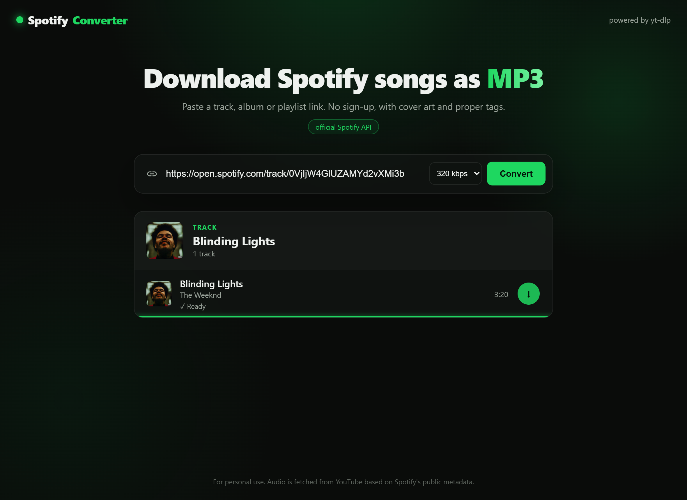

<div align="center">

# 🎵 SpotifyConverter

**Convert Spotify links (track, album or playlist) into `.mp3`** — up to 320 kbps,
with album cover and ID3 tags, through a clean web interface and **no sign-up**.


<br>



</div>

> Inspired by sites like spotidownloader.com, but with **configurable quality**,
> **full playlists/albums**, **`.zip`** downloads, embedded tags and — the key
> trick — **smart selection of the right audio version** (no grabbing the music video).

---

## ✨ Features

- Track, **album** or **playlist** — paste the link and go
- Selectable quality: **128 / 192 / 256 / 320 kbps**
- **Album cover + ID3 tags** (title, artist, album) embedded in the MP3
- **Picks the right audio track** on YouTube by duration + channel type
  (avoids music videos, live versions, remixes, loops…)
- **"Download all (.zip)"** button for collections
- **Real-time** progress (Server-Sent Events)
- Works **without sign-up**; optionally uses the **official Spotify API**
  for full playlists/albums and richer metadata

---

## ⚙️ How it works

Spotify serves audio with **DRM**, so no tool downloads the file "from inside"
Spotify. The flow (the same one every such site uses) is:

```
         ┌─ metadata (name, artist, album, cover) ──► from SPOTIFY
Link  ───┤
         └─ audio (the .mp3 itself) ────────────────► from YOUTUBE (yt-dlp)
                                                         └─ converted to MP3 + tags (ffmpeg + mutagen)
```

What makes this project different: instead of grabbing the first YouTube result
(usually the music video), it **searches several candidates and picks the best**
by comparing duration against Spotify's and preferring official audio channels.

---

## 🚀 Getting started

### Windows (easiest)

Double-click **`run.bat`**. It creates the environment, installs dependencies,
downloads `ffmpeg` and opens your browser.

### Manual (any OS)

```bash
git clone https://github.com/Dexz00/SpotifyConverter.git
cd SpotifyConverter

python -m venv .venv
# Windows:   .venv\Scripts\activate
# Linux/Mac: source .venv/bin/activate

pip install -r requirements.txt
python setup_ffmpeg.py        # downloads ffmpeg into ./bin (Windows); on Linux/Mac use your package manager
python run.py
```

Open **http://127.0.0.1:8000**, paste the link and click **Convert**.

> Downloaded files are **not stored** in the project. They are converted in a
> temporary system folder and **auto-deleted ~15 minutes** after the job
> finishes (configurable via `JOB_TTL_SECONDS` in `app/main.py`).

### Docker (one command, ffmpeg included)

```bash
docker build -t spotifyconverter .
docker run --rm -p 8000:8000 spotifyconverter
```

With the optional Spotify API credentials:

```bash
docker run --rm -p 8000:8000 \
  -e SPOTIFY_CLIENT_ID=your_client_id \
  -e SPOTIFY_CLIENT_SECRET=your_client_secret \
  spotifyconverter
```

Then open **http://127.0.0.1:8000**.

---

## 🔑 (Optional) Official Spotify API

It works without any of this. But with credentials you get **full
playlists/albums** (paginated) and richer metadata. A badge on the home page
shows which mode is active.

1. At https://developer.spotify.com/dashboard, **Create app** (Redirect URI can be `http://127.0.0.1:8000`)
2. Copy the **Client ID** and **Client Secret** under *Settings*
3. Copy `.env.example` to `.env` and fill it in:

   ```env
   SPOTIFY_CLIENT_ID=your_client_id
   SPOTIFY_CLIENT_SECRET=your_client_secret
   ```

4. Run again. If the credentials fail, it falls back to no-signup mode automatically.

> ⚠️ `.env` is in `.gitignore` — your credentials **never** reach GitHub.

---

## 🗂️ Structure

```
SpotifyConverter/
├── app/
│   ├── spotify.py       # metadata without API (embed page)
│   ├── spotify_api.py   # metadata via official API (optional)
│   ├── resolver.py      # chooses the best metadata source
│   ├── downloader.py    # search + selection + yt-dlp + ffmpeg + tags/cover
│   └── main.py          # FastAPI API + SSE progress + serves the frontend
├── web/                 # frontend (plain HTML / CSS / JS, no build step)
├── setup_ffmpeg.py      # downloads ffmpeg automatically
├── run.py               # server entry point
├── run.bat              # 1-click launcher (Windows)
├── Dockerfile           # container image (ffmpeg bundled)
└── requirements.txt
```

---

## 🛠️ Using it as a base (for the next dev)

- **Change the audio source?** Touch only `app/downloader.py` — `_pick_best`/
  `_score_candidate` decide which result to download; `download_track` does the rest.
- **Another format (m4a, flac, opus)?** Adjust `FFmpegExtractAudio` in `download_track`.
- **New metadata?** `app/resolver.py` is the single entry point; it falls back from official to embed.
- The **frontend** is plain HTML/CSS/JS in `web/` — no build, no framework, easy to edit.

PRs and forks welcome. 🙂

---

## ⚖️ Disclaimer

A tool for **personal and educational use**. Downloading copyrighted content may
violate Spotify's/YouTube's terms and the law in your country. Only use it with
material you have the right to download.

---

## 📄 License

[MIT](LICENSE) © [Dexz00](https://github.com/Dexz00)
